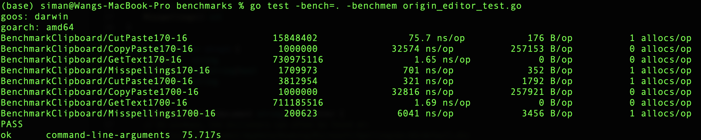
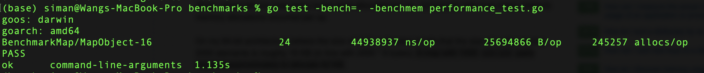
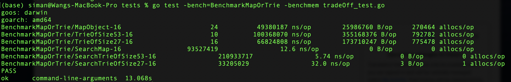
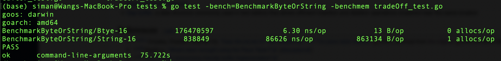
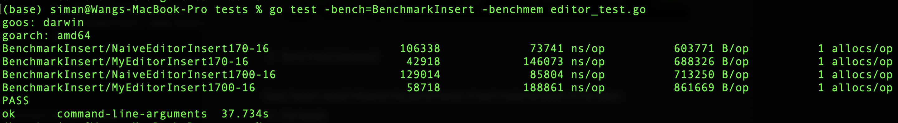
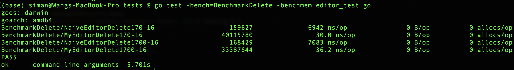
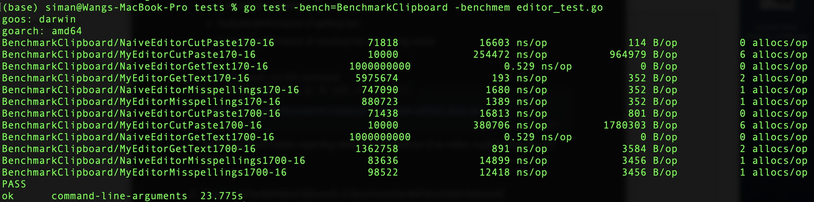
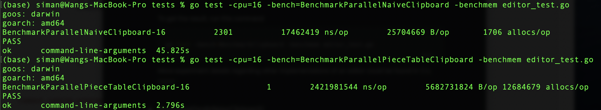

## Requirements

go 1.14

(No external libraries used)

----
## Run

### To run the demo
```bash
go run main.go
```

### To test
```bash
cd tests
go test -bench=. -benchmem editor_test.go
```
---

## Bottleneck analysis



B/op values tell you how many bytes were allocated per loop. allocs/op tells how many (distinct) memory allocations occurred per op.

I first used built-in testing tools of Go to find out the performance bottleneck.  As shown in the screenshots, apparently, CopyPaste and Misspelling are the two most expensive operations. And the reasons are obvious. 

1. It is inefficient  to keep everything in a single String object. Naive Copy and Paste directly process the large string via indices. Because strings are immutable, this approach would require a lot of reallocation. 
2. There are totally 235886 words of average length of 9 characters in the file "/usr/share/dict/words", which means that there are 235886 items in the map object. I tested the real memory usage of allocating such large map object, it turned out that a map with 235886 string-bool pairs required approximately to allocate 25.69MB.

    

    Also, searching a word in the dictionary can be faster by storing words in a Trie because it reduces the number of comparisons.

----
## Optimization

1. Piece table-based editor

    A Piece Table is a data structure typically used to represent a series of edits on a text document.

    Although a piece table itself is a data structure, it does not state how it should be implemented. The time complexity of operations depends on how the table is being implemented. One possible implementation of a piece table is in a splay tree, because it provides quick access to recently-accessed elements. Due to limited time, I implemented the piece table as an array of pieces. Thus, it takes O(n) times to scan the piece table, where n is number of editions.

    Several text editors use an in-RAM piece table internally, including Bravo, Abiword, Atom and Visual Studio Code.

2. Use Trie to store valid words

    Trie can accelerate Misspelling function because:

    - Predictable O(k) lookup time where k is the size of the key
    - Lookup can take less than k time if it's not there
    - Supports ordered traversal
    - No need for a hash function

    The screenshot shows that searching a word in Trie is roughly 2x faster than in Map

    

----
## Tradeoff

1. Alphabet size of nodes of Trie

    Since valid words contain uppercase, lowercase alphabets plus hyphen '-', the alphabet size should be 53. If we pre-process words such that all characters stored as lowercase, the total memory allocation would reduce by half (the size reduces to 27). However, each time we insert or find a word, we have to call strings.ToLower() to make each word lowercase, that requires additional resources; preprocessing takes 6x and 2.5x more time than Trie of size 53 and Map respectively.

    

    Decision: Define the Alphabet size of nodes of Trie as 53

2. Sequence data structures

    Discussion about pros and cons of sequence data structures (e.g. array, linked list, fixed size blocks, piece table) are of long history.

    - Array

        Not an efficient data structure if a lot of editing was to be done are large files. It is a useful base case and is a reasonable choice in situations where few inserts and deletes are made (e.g., a read-only sequence) or the sequences are relatively small (e.g., a one-line text editor).

    - Split buffer

        In this method, it has one large buffer that holds all the text but there is a gap in the middle of the buffer that does not contain valid text. The gap will be at the text cursor where all text editing operations take place.

        This method is simple and surprisingly efficient, but need to pivot the position of cursor, which may cause an amount of time to rewrite the given framework.

    - Linked list

        A span for each word in the file; and the span is kept in the descriptor. This requires a large (and file content dependent) number of descriptors which must be sequenced.

        The linked list method is efficient in insertion and deletion, but uses a lot of extra space and so is not appropriate for a large sequence.

    - Fixed size block

        The text editor decides the partitioning of the file into spans based on the efficiency of buffer use. Since fixed size blocks are more efficient to deal with, the file can be divided into a sequence of fixed size buffers. To fully employ the efficiency of disk management, the fixed size usually is the same as that of disk blocks.

        However, usually a lower bound on the number of items in a buffer is set (half the buffer size is a common choice). This requires moving items between buffers and occasionally merging two buffers to prevent the accumulation of large numbers of buffers.

    **The piece table method has several advantages.**

    - The original file is never changed so it can be a read-only file. This is advantageous for caching systems since the data never changes.
    - The add file is append-only and so, once written, it never changes either.
    - Items never move once they have been written into a buffer so they can be pointed to by other data structures working together with the piece table.
    - Undo is made much easier by the fact that items are never written over. It is never necessary to save deleted or changed items. Undo is just a matter of keeping the right piece descriptors around. Unlimited undoes can be easily supported.
    - No file preprocessing is required. The initial piece can be set up only knowing the length of the original file, information that can be quickly and easily obtained from the file system. Thus the size of the file does not affect the startup time.
    - The amount of memory used is a function of the number of edits not the size of the file. Thus edits on very large files will be quite efficient.

    Decision:  use piece table data structure

3. Type of buffer in the piece table method

    The piece table method uses two buffers. The first (the file buffer) contains the original contents of the file being edited. It is of fixed size and is read-only. The second (the add buffer) is another buffer that can grow without bound and is append-only. All new items (also called words/string) are placed in this buffer.

    Considering the type of buffers, appending a slice of byte would be more efficient, even though string type is more intuitive. I tested the performance of appending items of same size in a buffer of two types. The experiment result is as follows:

    

    Processing a buffer of type of a slice of byte is 13750x faster and 66395x more memory-efficient.

    Decision: use a slice of byte as a buffer

-----
## Benchmarks and Performance

1. BenchmarkInsert()

    Evaluate performance of inserting a string of random size (within 20 characters) at a random position.

    To get the result, run this command

    ```bash
    go test -bench=BenchmarkInsert -benchmem editor_test.go
    ```

    

    My editor is roughly 2x slower than the naive editor. The possible reason is that my editor has to do conversion from a raw string to a slice of byte.

2. BenchmarkDelete()

    Evaluate performance of deleting a string of random size at random position from the file.

    To get the result, run this command

    ```bash
    go test -bench=BenchmarkDelete -benchmem editor_test.go
    ```

    

    My editor is roughly 200x faster than the naive editor.

3. BenchmarkClipboard()

    Many factors would influence the performance of each implementation of the editor:

    - File length
    - The distribution of location of edits
    - The length of span of edits

    For other implementations like fixed size blocks, the disk and memory block size should be taken into consideration.

    There are four experiments showing the performance differences:

    - Evaluate performance of cutting a string of random size at random position, and then paste it at a random position
    - Evaluate performance of getting text
    - Evaluate performance of counting the misspelling words

    To get the result, run this command

    ```bash
    go test -bench=BenchmarkClipboard -benchmem editor_test.go
    ```

    

    Basically, the naive editor outperformed my editor. The main reason is that StringAt() takes O(n) time to concatenate spans to which pieces point. Cut() is actually a combination of StringAt() and Delete(); while Copy() is nearly StringAt().

    More experiment details regarding other implementations of an editor could be found in [this paper](https://www.cs.unm.edu/~crowley/papers/sds.pdf)

4. BenchmarkParallelNaiveClipboard() & BenchmarkParallePieceTableClipboard()
    - Evaluate performance of copying a string of random size at random position, and then paste it at a random position

    Both tests are killed due to timeout in single core. Thus, i ran two benchmarks in parallel. It creates multiple goroutines and distributes b.N iterations among them.

    To get the result, run this command

    ```bash
    go test -cpu=16 -bench=BenchmarkParallelNaiveClipboard -benchmem editor_test.go
    go test -cpu=16 -bench=BenchmarkParallelPieceTableClipboard -benchmem editor_test.go
    ```

    

-----
## Possible Extension

1. Support Undo operation

    With a piece table, Undo is made much easier by the fact that items are never written over. It is never necessary to save deleted or changed items. Undo is just a matter of keeping the right piece descriptors around. Unlimited undoes can be easily supported.

2. Implement the piece table as a splay tree

    I defined the piece table as an array of pieces. Most of time was spent in locating the affected pieces and concatenating spans. One possible implementation of a piece table is in a splay tree, because it provides quick access to recently-accessed elements.

------
## Reference

1. Data Structures for Text Sequences, Charles Crowley University of New Mexico; [https://www.cs.unm.edu/~crowley/papers/sds.pdf](https://www.cs.unm.edu/~crowley/papers/sds.pdf)
2. The Craft of Text Editing or Emacs for the Modern World, Craig A. Finseth; [http://www.finseth.com/craft/index.html](http://www.finseth.com/craft/index.html)
3. [https://en.wikipedia.org/wiki/Piece_table](https://en.wikipedia.org/wiki/Piece_table)